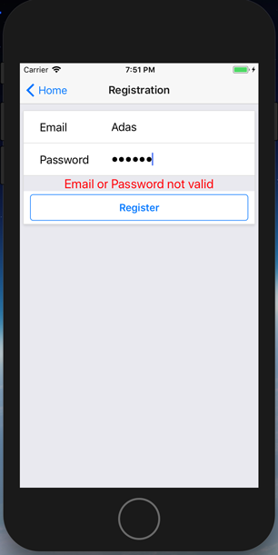
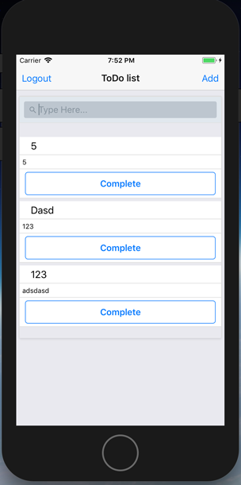

## Report Web-client 
:fire::triumph::fire:
### How to start  
1. Run api from project root  
`docker-compose up -d`

2. Run react-native app  
`react-native run-ios`  
OR  
`react-native run-android`
## Issues/Solutions
 
#### No bundle url present  
[#12754](https://github.com/facebook/react-native/issues/12754)
1. Run "react-native run-ios"  
2. When the error appears, run "npm install"  
3. Then run "react-native run-ios" again.  

## Advantages, disadvantages & improvements
| Status          | Description | Improvement
| ----- | ----- | ----- |
| +  |  Same functionality as web-client | |
| -  |  Complexity, bugs | Practise more & bug hunting|
| +/-  | Store toke as state in reducer | Use async storage for it (possible solution)|
| +/-  | Error handling |Elaborate more on it|
| +/-  |  Project structure | Could be better, again practise|
| +  |  Redux, react-redux, redux-thunk| Practise more, refactor reducers by small peaces |
| +  |  I think it was good solution use react component as a buffer zone to transfer state from one reducer to another. It low-coupling between reducers. Example is token which need to be transfered from one reducer to action and produce new state in another reducer |  |
| +  |  Routing with react-native-router-flux | Read documentation, especially for Stack component and MobX-friendly (observable for state) |
| -  |  Logout does not work properly, and reason is button belongs to Header which is child of Route elements. Issue how to connect Route to redux  | Implement custom header, extends from react component, connect to redux. Or connect Route directly to redux (has some issues with it) |

## Sources  
UI  
for common elements I used this [REPO](https://github.com/StephenGrider/ReactNativeReduxCasts/tree/master/auth/src/components/common)   
[react-native-elements](https://github.com/react-native-training/react-native-elements)  
Routing  
[react-native-router-flux](https://github.com/aksonov/react-native-router-flux)  
State  
[redux](https://github.com/reactjs/redux)  
[react-redux](https://github.com/reactjs/react-redux)  
[redux-thunk](https://github.com/reactjs/react-redux)

## Screenshots
\#1  
  
\#2     
  
\#3  
  
\#4  
  
\#5  
 