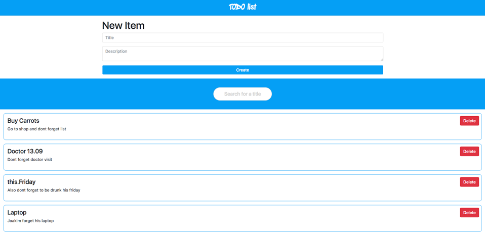

# Report  
* Screenshot  
  
### Comments  
I have done all tasks including bonus tasks: use ESLint and Search feature.  
To accelerate development process I used [json-server](https://github.com/typicode/json-server)  
DB schema example in `./mocked_db.json` 
### My choose  
* Server file for node contains only 3 requests, I decided leave all of them in one place and do not extract methods.   
* Imported fonts from [Google fonts](https://fonts.google.com/)  
* Bootstrap
### Search feature  
Search function is looking for entries in title of given symbols

### How to up app
Install modules `npm install`

* (Default)   

1 DB `mongod`  
2 NODE  `node server.js`  
3 APP `npm start`

* (With json-server)  

1 Install json-server `npm install -g json-server`  
2 Change `util/api.js` to  
```
// json-server
const rootPath ='http://localhost:3004'

// mongo db
// const rootPath = 'http://localhost:1234'

export const URL_LISTS = `${rootPath}/items`
```
3 Run `json-server mocked_db.json --id _id --port 3004` for mcoking backend & DB.  
4 Run application `npm start`

* Or just run predefined scripts
`npm run dev-mongo`  
OR 
`npm run dev-json-server`

### URL-structure  
To build RESTful api I used my previous experience & several best-practises guidelines from 
companies such as 
[Microsoft](https://github.com/Microsoft/api-guidelines/blob/vNext/Guidelines.md), 
[Google](https://cloud.google.com/apis/design/) etc...  
TODO list has items.  
To get all items `root/items`  
To get item by id `root/items/:id`  
To delete item by id `root/items/:id`  

### Requirements
All requirements are fulfilled. [Ref](https://github.com/theneva/pg6300-17/blob/master/a01/a01.md)

#  Discussion
1. Hva er noen fordeler og ulemper ved å benytte en stack bygget på kun JavaScript?   
`Advantages`   
There several advantages using only JavaScript in build stack. 
Developers can work in several layers of build stack, which make them universal.
JavaScript is the most famous language. Companies, using JS build stack, can
find or exchange engineer faster, which reduce costs. 
Most of development tools are free, which is just awesome. 
Another important thing is fast data transfer. 
All technologies in JS build stack works with the same data processing (use JSON).
There are plenty of frameworks, libraries, plugins for any cases. 
The most popular APIs have JS client. Another advantage is 
that development process can be faster because huge community 
and plenty of already have done solutions (code re-usage). 
Most of modern JS technologies are cloud-native, 
which make maintenance, deploy and support easier. 
It is also easier to GET STARTED with JS build stack, there are many free resources for it.  
`Disadvantages`  
Backwards compatibility and limitations for technologies in one stack. 
Mainstream of popular technologies change fast. Bright example of these 2 disadvantages are Angular.
Performance of MongoDB general is lower than Postgres or MySQL. 
Developers tied to one programming language. Huge amount of library can be found to solving one exact problem, 
sometimes it is difficult to find good quality library.  
  
2. Hva er et (web-)API, og hva er noen fordeler og ulemper ved å lage et? Når bør man ikke lage et API?  
API is Application Programming Interface. It is documented way for one application to communicate with another. 
A Web API communicate through REQUESTS & RESPONSES. There are two famous approaches: 
* REST (Representational State Transfer)  
An architectural style for managing state information. 
Following constraints [Hypermedia](https://en.wikipedia.org/wiki/Hypermedia) and [HATEOAS](https://en.wikipedia.org/wiki/HATEOAS) 
It  focuses on resource-based (or data-based) operations and inherits its operations (GET, PUT, POST, DELETE) from HTTP.
* SOAP  
A protocol specification for transfer structured information. XML-based messaging. 
It has set of strict rules for implementation of this approach.    
  
`Advantages`  
Web api is a simple data-processing solution for communication between systems, applications, web services.
Separation between client and server which improve system flexibility. Web APIs can be written with different programming language and use different platforms, 
 APIs are independent of the type of platform or language.  
`Disadvantages`  
There are many different implementations of APIs available, so many different implementation ways.  
It's difficult to tell what really is "right". The availability & response time of application are dependent on the availability and architecture style of the APIs it use. 
Solution is to build Responsive, Resilient, Elastic, Message Driven APIs. One of the mainstream's solution is 
[Reactive manifesto](http://www.reactivemanifesto.org/), requires knowledge in different fields. 

When you should not build API. The first case when your application does not provide access to its resources.
The second case is transfer or analyze streaming data.


### Sources
[Quora](https://www.quora.com/What-are-the-pros-and-cons-of-MEAN-javascript-stack-vs-LAMP-stack)  
[Altexsoft](https://www.altexsoft.com/blog/engineering/the-good-and-the-bad-of-javascript-full-stack-development/)
[BBVA](https://bbvaopen4u.com/en/actualidad/rest-api-what-it-and-what-are-its-advantages-project-development)
