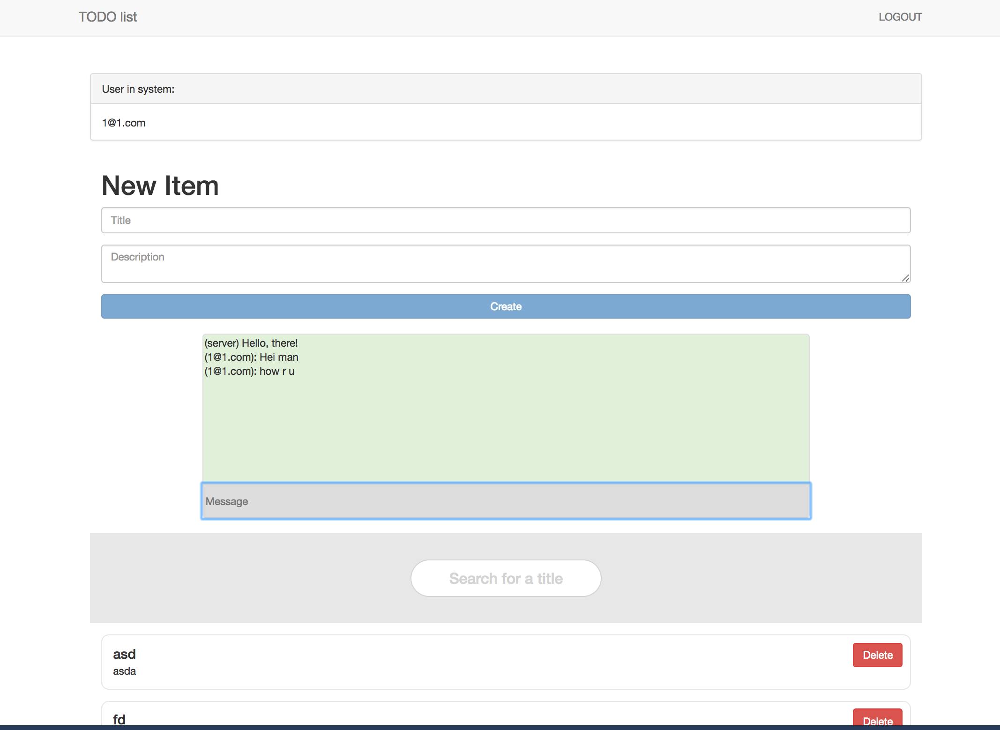

## Report Web-client
### Screenshots  
\#1  
  
\#2     
  
\#3  
  
\#4  
  
\#5  
  
### Comments  
I have done all tasks including bonus tasks: use ESLint,
Search feature and as WebSocket implementation I chose Chat.  
I also rebuild web-client and now after deleting list-item, 
the list refreshes without page reloading. 

### URL-structure  
| URL          | Description |
| ------------- | ------------- |
| `/` |  Redirect to `/home` | 
| `/home` |  if user logout show welcome page (screenshot #1). If user loggedIn show todo-list of that user (screenshot #4) | 
| `/login` |  Login form. onSubmit success: redirect to `/home` (screenshot #4) | 
| `/signup` |  Sign up form to create new user. onSubmit success: redirect to `/home` (screenshot #1)| 
| page not found | screenshot #5 | 

### (+)Advantages, (-)disadvantages & improvements
| Status          | Description | Improvement
| ----- | ----- | ----- |
| +  |  Simplicity | |
| -  |  Authentication strategy | Improve authentication strategy. For example make token with expire date and use cookie to make auth process more secure|
| +  |  Search feature | Possibility to avoid eager data fetch. Improve efficiency |
| +  |  Async reloading. List refresh | Optimize code |
| +  | Docker  | Improve networking and linking between docker containers|
| +  | Chat  | Add tests for web sockets|

### Requirements
All requirements are fulfilled. [Ref](https://github.com/theneva/pg6300-17/blob/master/a01/a01.md)